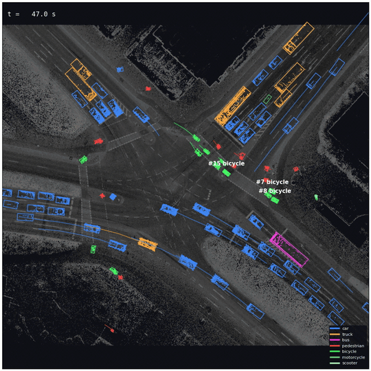
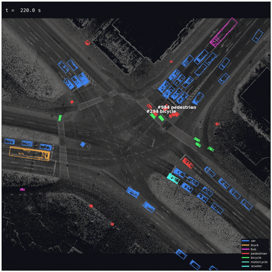
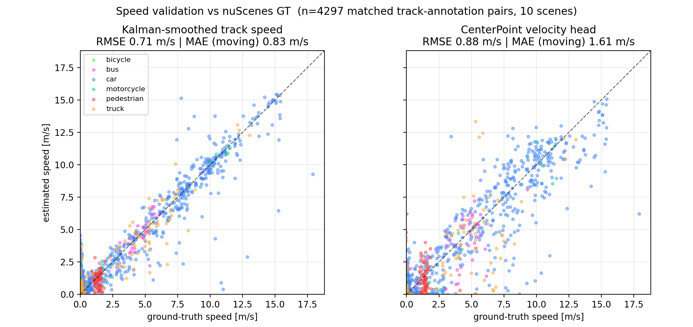
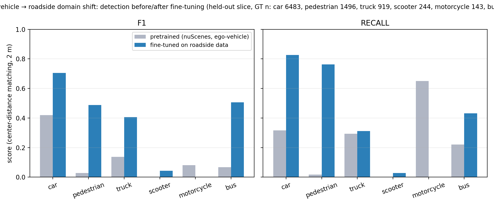
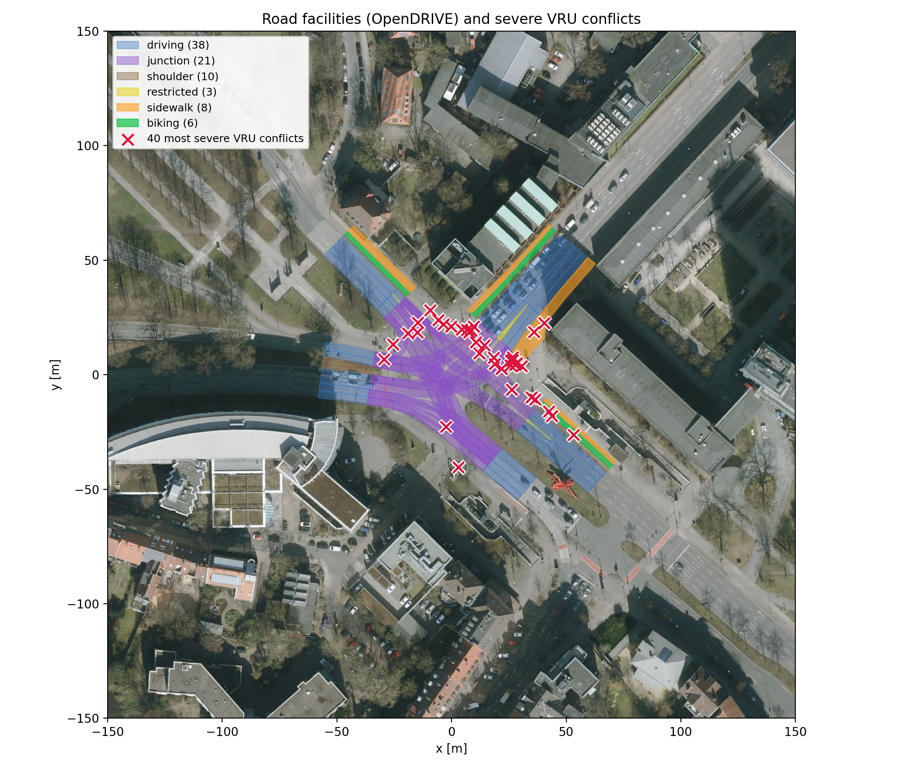
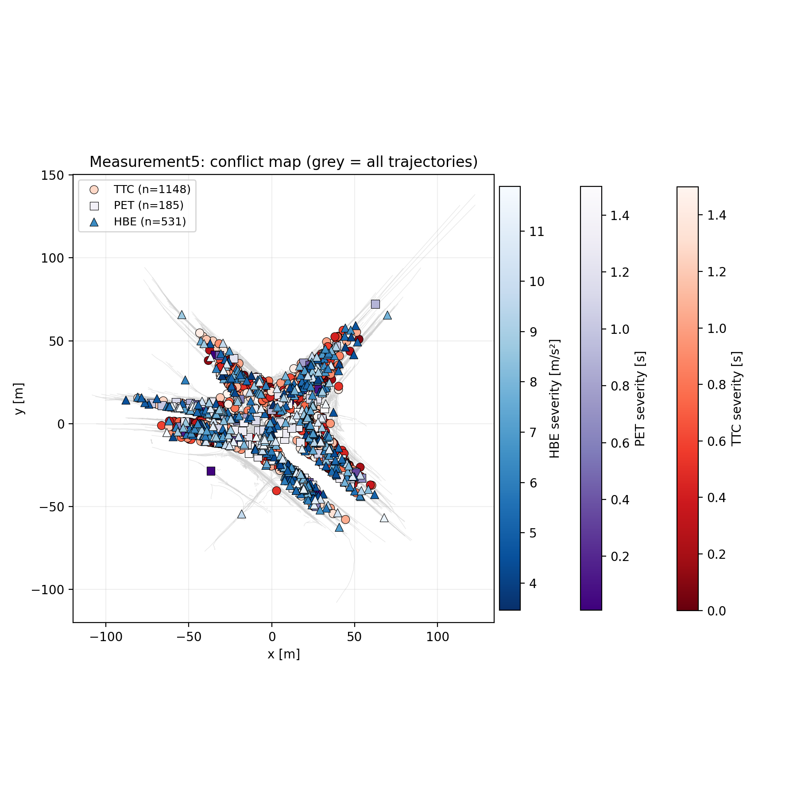
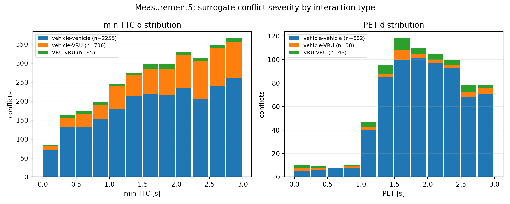
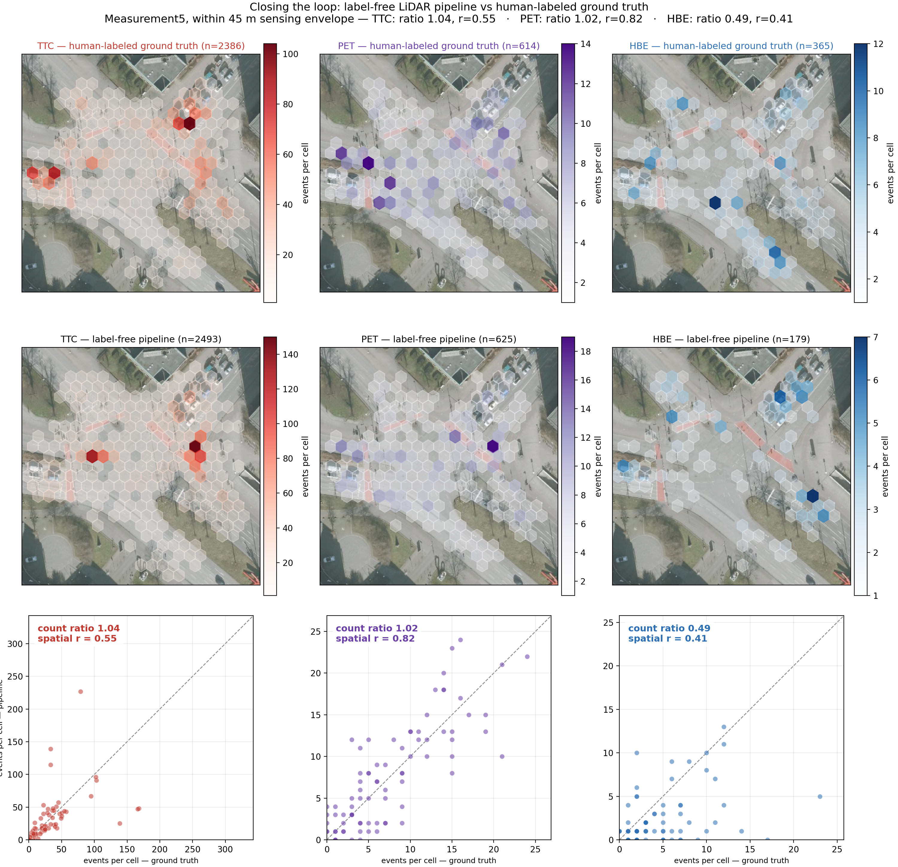

# LiDAR Surrogate-Safety Pipeline

**Label-free road-safety analysis from roadside LiDAR**: 3D detection → multi-object tracking → offline smoothing → kinematics → surrogate safety metrics (TTC, PET, hard braking), validated event-by-event against 12.6 minutes of human-annotated ground truth at a real urban intersection.

<p align="center">
  
  <br/>
  <em>Tracked road users (boxes, class-colored trails) over the survey-grade reference scan of the study intersection — Königsworther Platz, Hanover, from the LUMPI dataset [5]. (<a href="media/refscan_3d_spin.mp4">full clip</a>, <a href="media/refscan_3d_capture.mp4">second view</a>)</em>
</p>

**Headline result** — running the full machine pipeline on raw point clouds (no labels anywhere) and mining the same conflict definitions as on the human-labeled trajectories reproduces the intersection's safety picture at count parity on all three metrics, within the detector's 45 m sensing envelope:

| | TTC conflicts | PET conflicts | Hard-braking events |
|---|---|---|---|
| count ratio (pipeline / ground truth) | **0.97** | **0.98** | **1.01** |
| hotspot spatial correlation *r* | 0.56 | 0.85 | 0.76 |

---

## The pipeline

```
point clouds ──► CenterPoint (pillar encoder) [1], MMDetection3D [2]
                    │   pretrained on nuScenes [4], fine-tuned on LUMPI [5]
                    ▼
              Kalman tracker (AB3DMOT-style [3], this repo)
                    │   Hungarian association, per-class gates,
                    │   velocity-head seeding, yaw-flip handling
                    ▼
              RTS smoother (offline forward–backward pass [9], this repo)
                    │   causal filters must lag maneuvers; recorded data
                    │   has a future, so braking peaks survive
                    ▼
              kinematics: speed, heading, longitudinal acceleration
                    ▼
              surrogate safety metrics
                TTC  ≤ 3 s   time-to-collision, point-mass closing model [7]
                PET  ≤ 3 s   post-encroachment time at path crossings [8]
                HBE          sustained deceleration beyond −3 m/s² [6]
```

Everything downstream of the detector is implemented from scratch in `src/lidar_pilot/` (no tracking/filtering dependencies) and covered by 44 closed-form synthetic tests.

## Detected conflicts — machine vs reality

The two most severe vulnerable-road-user conflicts in the ground truth are independently rediscovered by the label-free pipeline. Each clip shows tracked boxes and trails over the frozen reference scan; the conflict pair is highlighted with the running TTC/PET readout.

| Bicycle–bicycle, PET 0.01 s | Bicycle–pedestrian, TTC 0.04 s |
|---|---|
|  |  |
| one cyclist crosses the other's path with a 0.01 s margin ([full clip](media/conflict_bike_bike.mp4)) | near-miss on the crossing island ([full clip](media/conflict_bike_ped.mp4)) |

A vehicle–pedestrian example is in [`media/conflict_car_ped.mp4`](media/conflict_car_ped.mp4). Interactive 3D recordings (point clouds + boxes + trails in the [rerun](https://rerun.io) viewer) can be regenerated with `scripts/make_lumpi_rrd.py`.

## Results

### 1 · Speed estimation validated on nuScenes

Pretrained CenterPoint + this repo's tracker on nuScenes-mini (10 scenes, 2 Hz keyframes): Kalman-smoothed track speeds reach **RMSE 0.71 m/s** against ground-truth box velocities (n = 4,297), beating the detector's own velocity head (0.88 m/s) — the head seeds association, the filter does the kinematics.

<p align="center"></p>

### 2 · Domain shift: ego-vehicle → roadside is not free

A nuScenes-pretrained detector collapses on roadside multi-LiDAR data (pedestrian recall 0.00 — every pedestrian missed). Fine-tuning on 3,000 LUMPI frames (time-split train/val, 20 epochs, ~2 h on one GPU) repairs it:

| class (n in val) | F1 pretrained | F1 fine-tuned |
|---|---|---|
| car | 0.42 | **0.70** |
| pedestrian | 0.03 | **0.49** (recall 0.00 → 0.76) |
| bus | 0.07 | **0.51** |
| truck | 0.14 | **0.41** |

…and ~12k phantom detections of classes that don't exist in the scene (barriers, traffic cones) are eliminated. Rare classes (motorcycle n = 34, scooter) did not learn from so few instances — class-balanced resampling (CBGS) is the known fix and listed as future work.

<p align="center"></p>

### 3 · Ground-truth conflict study: where the risk lives

Mining the human-annotated LUMPI trajectories (Measurement5: 12.6 min, 5 fused LiDARs, 10 Hz — LUMPI numbers its recording campaigns 0–6; #5 is the densest) yields 1,592 moving road users with trustworthy class labels, producing **2,774 TTC conflicts (< 3 s), 743 PET events (< 3 s) and 1,044 hard-braking events**.

Tagging every conflict with its road facility from the OpenDRIVE map:

| facility | share of VRU-involved conflicts |
|---|---|
| unmapped crossing islands | 45 % |
| junction area | 41 % |
| driving lanes | 9 % |

**→ 86 % of vulnerable-road-user conflicts happen while crossing, not while riding along traffic.** The intersection's VRU risk is a crossing phenomenon.

<p align="center"></p>
<p align="center"><em>OpenDRIVE lane polygons over the orthophoto; white-haloed crosses are the most severe VRU conflicts. Orthophoto: © GeoBasis-DE / LGLN (2026), CC BY 4.0.</em></p>

Per-metric hotspot maps and severity distributions (severity shapes match the surrogate-safety literature):

<p align="center"></p>
<p align="center"></p>

### 4 · Closing the loop: the label-free pipeline vs the human reference

The capstone experiment: run detection + tracking + smoothing + mining on raw point clouds with **no labels anywhere in the chain**, then compare conflict sets like-for-like inside the detector's sensing envelope.

<p align="center"></p>

Per-cell agreement is computed on an 8 m grid; the count ratios and spatial correlations in the header are the headline table above. Beyond counts, events are matched **one-to-one** (Hungarian assignment on same-vehicle + braking-onset time), which is a stricter and more honest test than count parity:

- hard-braking event recall 0.34 / precision 0.34 against the noisy human reference
  (a naive tracker baseline manages 0.16 / 0.43 — F1 0.23 vs 0.34)
- every miss is attributed to a cause (no track / filtered track / estimate damped / noise spike / unmatched), so improvements target mechanisms, not metrics

Three things made the braking column reach parity, found via the experiment harness (`scripts/sweep_hbe_recovery.py`, ~50 configurations evaluated from a one-pass detection cache):

1. **An epsilon-tolerant event-duration gate.** With 10 Hz timestamps, `(k+2)/10 − k/10` lands on either side of 0.2 by floating-point dust depending on the start frame — silently deleting ~40–50 % of exact-length braking events from *any* source, including the ground truth. Regression-tested fix in `metrics/events.py`.
2. **Tracking-by-detection + offline RTS smoothing.** A causal Kalman filter must lag real maneuvers, smearing deceleration peaks below the −3 m/s² threshold (miss attribution showed the braking vehicle was *always* tracked — coverage was never the problem). The pipeline therefore records raw matched detections and smooths finished tracks with a Rauch–Tung–Striebel forward–backward pass [9] (`tracking/smoother.py`).
3. **Noise calibration against reference events.** The smoother's q/r bandwidth was calibrated on ground-truth-confirmed braking windows; a textbook 0.4 m measurement-noise guess recovers 8 % of true braking windows, the calibrated 0.15 m / 15 m/s² recovers ~85 %.

Throughput: ~5.7 fps end-to-end on a single RTX 5090 (detection-bound); re-tracking experiments from the detection cache run at ~250 fps on a laptop CPU.

## Honest limitations

- 12.6 minutes of one afternoon; no exposure normalization; surrogate conflicts are *correlates* of crash risk, not crashes [6].
- Count parity ≠ event identity: at matched counts, one-to-one event agreement for hard braking is 0.34 recall / 0.34 precision — partly genuine pipeline misses, partly label noise in the reference itself (27 % of moving ground-truth tracks fail class-kinematics plausibility and are excluded from mining on both sides).
- TTC's point-mass + combined-radius model inflates car-following conflicts; PET is exact at path crossings.
- The tops of severity-sorted lists attract artifacts; the miner is hardened (duplicate/fragment suppression, kinematic class-plausibility, physical deceleration bounds), but the principle stands.
- Rare classes (motorcycle, scooter) remain unreliable after fine-tuning.

## Repository layout

```
src/lidar_pilot/
  tracking/        Kalman filter per box, Hungarian tracker, RTS smoother
  metrics/         TTC, PET, hard-braking event extraction (formulations in docstrings)
  conflicts.py     artifact-hardened conflict miner (library)
  kinematics.py    speed / heading / longitudinal acceleration
  io/              LUMPI label adapter, minimal OpenDRIVE lane-polygon parser
  viz.py           class colors, orthophoto loader
scripts/           pipeline runners, conflict mining CLI, evaluation/sweep
                   harness, figure + video generators (usage in docstrings)
tests/             44 closed-form synthetic scenarios
figures/ media/    everything shown above
```

## Reproducing

Local metrics development (no GPU needed):

```bash
python3 -m venv .venv
.venv/bin/pip install -e ".[dev]"
.venv/bin/pytest          # 44 tests
```

The full chain, given the datasets:

```bash
# ground-truth study (labels → tracks → conflicts → figures)
python scripts/run_lumpi_conflicts.py
python scripts/extract_conflicts.py outputs/lumpi
python scripts/tag_conflict_lanes.py outputs/lumpi data/lumpi/lumpi_lines_arcs.xodr
python scripts/plot_conflict_analysis.py outputs/lumpi

# label-free pipeline (GPU; caches every raw detection on the way)
python scripts/run_lumpi_pipeline.py \
    --lidar-dir data/lumpi/Measurement5/lidar --out-dir outputs/lumpi_e2e \
    --save-detections outputs/lumpi_e2e/detections.pkl
python scripts/extract_conflicts.py outputs/lumpi_e2e --hbe-smooth-window 1
python scripts/plot_e2e_validation.py

# evaluate / experiment from the cache (CPU-only, ~250 fps re-tracking)
python scripts/sweep_hbe_recovery.py eval --gt-conflicts outputs/lumpi/conflicts.csv \
    --pipe-conflicts outputs/lumpi_e2e/conflicts.csv \
    --pipe-tracks outputs/lumpi_e2e/tracks_Measurement5_e2e.pkl
python scripts/sweep_hbe_recovery.py sweep --detections outputs/lumpi_e2e/detections.pkl \
    --gt-conflicts outputs/lumpi/conflicts.csv --out-dir outputs/hbe_sweep --jobs 6
```

GPU stack: detection runs on CUDA via MMDetection3D v1.4.0. On Blackwell GPUs (RTX 50-series, sm_120) prebuilt wheels do not exist; the working recipe is torch 2.7.1 (cu128 index), mmcv 2.1.0 built from source with `MMCV_WITH_OPS=1 FORCE_CUDA=1 TORCH_CUDA_ARCH_LIST="12.0"`, then mmdet 3.3.0 and mmdetection3d v1.4.0 with `--no-build-isolation`. Pretrained CenterPoint-pillar weights come from the MMDetection3D model zoo (URLs in `configs/centerpoint/metafile.yml`).

## Data, licenses, attribution

- **LUMPI** [5] — multi-perspective roadside intersection dataset (point clouds, labels, maps), [data.uni-hannover.de/dataset/lumpi](https://data.uni-hannover.de/dataset/lumpi), **CC BY-NC 3.0**. The videos, GIFs and map-based figures in this repository are non-commercial derivatives of LUMPI data, attributed here. One verified erratum used throughout this repo: `Label.csv` class ids are 0-based (0 = pedestrian, 1 = car, 2 = bicycle, 3 = motorcycle, 4 = bus, 5 = truck, 6 = scooter), confirmed empirically against box dimensions.
- **nuScenes** [4] — [nuscenes.org](https://www.nuscenes.org), non-commercial terms of use.
- **Orthophoto** — Lower Saxony open geodata WMS (`ni_dop20`), © GeoBasis-DE / LGLN (2026), [CC BY 4.0](https://creativecommons.org/licenses/by/4.0/).

## References

[1] T. Yin, X. Zhou, P. Krähenbühl, "Center-based 3D Object Detection and Tracking," *CVPR*, 2021. [arXiv:2006.11275](https://arxiv.org/abs/2006.11275)

[2] MMDetection3D Contributors, "OpenMMLab's Next-generation Platform for General 3D Object Detection," 2020. [github.com/open-mmlab/mmdetection3d](https://github.com/open-mmlab/mmdetection3d)

[3] X. Weng, J. Wang, D. Held, K. Kitani, "3D Multi-Object Tracking: A Baseline and New Evaluation Metrics," *IROS*, 2020. [arXiv:1907.03961](https://arxiv.org/abs/1907.03961)

[4] H. Caesar et al., "nuScenes: A Multimodal Dataset for Autonomous Driving," *CVPR*, 2020. [arXiv:1903.11027](https://arxiv.org/abs/1903.11027)

[5] S. Busch, C. Koetsier, J. Axmann, C. Brenner, "LUMPI: The Leibniz University Multi-Perspective Intersection Dataset," *IEEE Intelligent Vehicles Symposium (IV)*, 2022, pp. 1127–1134. [doi:10.1109/IV51971.2022.9827157](https://doi.org/10.1109/IV51971.2022.9827157)

[6] L. Liu et al., "Smartphone-based Hard-braking Event Detection at Scale for Road Safety Services," *Transportation Research Part C*, 2022 (the −3 m/s² hard-braking definition). [arXiv:2202.01934](https://arxiv.org/abs/2202.01934)

[7] J. C. Hayward, "Near-miss Determination Through Use of a Scale of Danger," *Highway Research Record* 384, 1972 (time-to-collision).

[8] B. L. Allen, B. T. Shin, P. J. Cooper, "Analysis of Traffic Conflicts and Collisions," *Transportation Research Record* 667, 1978 (post-encroachment time).

[9] H. E. Rauch, F. Tung, C. T. Striebel, "Maximum Likelihood Estimates of Linear Dynamic Systems," *AIAA Journal* 3(8), 1965 (RTS smoother).
